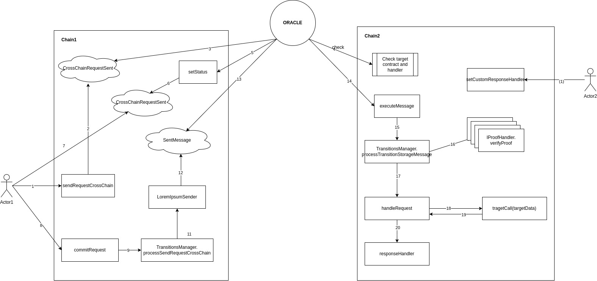

# EVM-Lorem-Ipsum

The repository contains the implementation of the Lorem Ipsum that includes Solidity smart contracts and tests.

----------------------------
### Project architecture

* Oracle -- entry point that provides API for initiation cross-chain send request. Also, it handles response data with the target contract. The current implementation supports prior verification of the destination chain verification (destination smartcontract).
* Transition manager -- is the middle layer responsible for the light client state update on the receiver side and proof request handling on the sender side.
* AMB -- sends/recive crosschain raw data.

On the picture below is the overall design of the contracts:

----------------------------
### How to
When all needed tools are installed:
- npm >= 8.19.0
- hardhat >= 2.14.0
- node >= 16.20.0

Make sure you have SSH token for GitHub and the use:
```
git clone git@github.com:NilFoundation/evm-lorem-ipsum.git --recursive
cd evm-lorem-ipsum
npx hardhat compile
npx hardhat test
```
----------------------------
## Any questions?
Fill free to reach out:
@Zontec -- Ilya Marozau (ilya.marozau@nil.foundation)
@SK0M0R0H -- Ilia Shirobokov (i.shirobokov@nil.foundation)